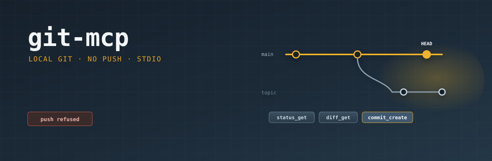

# git-mcp

<p align="center">
  
</p>

<p align="center">
  <a href="https://github.com/shotah/git-mcp/actions/workflows/ci.yml"></a>
  <a href="https://github.com/shotah/git-mcp/actions/workflows/release.yml"></a>
  <a href="https://github.com/shotah/git-mcp/actions/workflows/ci.yml"></a>
  <a href="https://pkg.go.dev/github.com/shotah/git-mcp"></a>
  
  <a href="LICENSE"></a>
</p>

Local git over MCP stdio. Server id `git`. The host calls `git__status_get`.

No push, pull, fetch, rebase, or reset. A directory that is not a git work tree fails at startup so the host can skip this server and keep `fs` up.

Naming: [george docs/mcp-naming.md](https://github.com/shotah/george/blob/main/docs/mcp-naming.md).

## Tools

| Tool | Host call |
| --- | --- |
| `status_get` | `git__status_get` |
| `diff_get` | `git__diff_get` |
| `commits_list` | `git__commits_list` |
| `stage_update` | `git__stage_update` |
| `commit_create` | `git__commit_create` |

`commit_create` commits the index. It does not stage and it does not push.

## Run

```bash
go install github.com/shotah/git-mcp@latest
git-mcp --root /workspace --tool-tier core
```

```toml
[[server]]
name    = "git"
command = "git-mcp"
args    = ["--root", "/workspace", "--tool-tier", "core"]
force   = true
```

## Development

```bash
make lint
make test
make coverage   # fails below 70%
make release    # patch bump; BUMP=minor|major or TAG=v0.2.0
```

CI (`.github/workflows/ci.yml`) runs the same lint, tests, and `scripts/check-coverage.sh` at 70%. `make check` is the local equivalent. `make release` writes `VERSION`, tags `v*` and floating `latest`, and pushes so the Release workflow runs.
